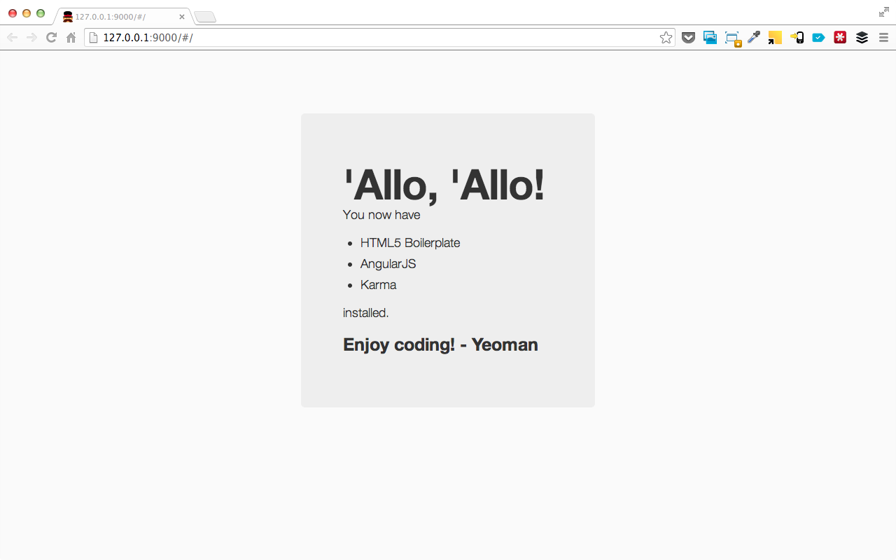

# AngularJS App usando Yeoman

## O que vamos ver

* Yeoman e Generators
* Bower
* Grunt
* AngularJS
	* Gerando o App
	* Instalando uma nova dependencia (bower)
	* Yeoman Generators
	* Tests

## Pré-requisitos

* Você precisa ter conhecimentos básicos de linha de comando
* Ter o [NodeJS e NPM](http://nodejs.org/) instalados
* Bons conhecimentos em Javascript, CSS e HTML

## Yeoman

O Yeoman vai além de uma ferramenta, é um workflow. 

Conjunto de ferramentas e boas praticas fazendo que o desenvolvimento para web melhor e mais ágil.

Foco em aumentar a produtividade.

### Instalação:

	npm install -g yo

Essa instrução já vai instalar o Yeoman, Grunt e Bower automaticamente.

### Ferramentas:

* yo, scaffolding tool
* grunt, tasks tool
* bower, package mandagement

#### Yo

Inicializa o seu projeto, criando o esqueleto da aplicação, criar uma configuração para o ```bower``` e para o ```grunt``` já implementando algumas tasks essenciais que você provavelmente vai precisar.

#### Grunt

Automatiza tarefas repetitivas, como fazer build, testes e preparar o projeto para ser executado.

#### Bower 

Gerência as dependências do seu projeto, você não precisa mais ficar fazendo download manual e gerenciar versões de bibliotecas de terceiros.

#### Yeoman Generators

São como receitas para você inicializar uma aplicação. 

A idéia por trás desse conceito é você criar os esqueletos dos seus projetos com as suas boas práticas e conveções.

Já existe uma série de Generators disponíveis. Você pode encontrar executando essa instrução no seu terminal.

	npm search yeoman-generator

Nós vamos usar o generator no AngularJS:

	npm install -g generator-angular

## AngularJS

É um framework com uma série de peculiaridades e características eficientes e poderosas.

### Gerando um app AngularJS com Yeoman

Para gerar o App você só precisa disso:

	yo angular

O Generator vai fazer uma série de perguntas do que você pretende instalar. Você pode responder sim para todas.

Em alguns segundos o generator faz a magica dele e temos uma aplicação funcionando. O Yeoman vai criar vários arquivos e pastas, executa o ```bower install``` (para instalar as dependências da aplicação) e executa o ```npm install``` (para instalar as dependências das tarefas do grunt).

Algumas pastas e arquivos importante:

**app/: ** A pasta contém os seus arquivos estáticos, seu html, css e javascript, onde provavelmente você vai passar a maior parte do seu tempo. 

**package.json: ** Esse arquivo configura o que o npm fará no seu projeto. Ele gerência as depêndencias das tarefas do grunt.

**node_modules/: ** A pasta onde o npm instala suas dependências.

**Gruntfile.js :** É um arquivo javascript responsavel por configurar as tarefas que o grunt vai executar no seu projeto. Ele define variáveis de ambiente, as tarefas e a sequência que as tarefas serão executadas.

**bower.json: ** Ele funciona como o ```package.json```, mas para o bower. Em algumas versões mais antigas esse arquivo pode ser component.json.

**.bowerrc: ** Ele configura algumas variáveis gerais do bower.

**arquivos Karma: ** Karma é um framework de testes. Esses arquivos configuram ou executam alguns testes na sua aplicação.

Esse são alguns arquivos que eu defini como importante, mas existem muito outros, cada um com uma funcionalidade e foco durante o workflow.

### Executando o App

Acabos de criar e entender o que acontece durante o processo de inicialização da aplicação.

Para executala, basta executa esse comando no seu terminal:

	grunt server

Ele vai executar algumas tarefas, subir um servidor http na porta 9000, iniciar o livereload e executar a tarefa ```watch``` que fica observando a sua pasta app/ e exectua algumas tarefas quando algum arquivo é alterado. 

Por fim ele vai abrir seu navegador já com a aplicação executando. Você vai ver algo assim:



### Instalando uma nova dependencia (bower)

Como já vimos antes o bower é um gerenciador de dependências. Nele você vai encontrar desde frameworks, como o Twitter Bootstrap, bibliotecas Javascript, plugins de jQuery e outras coisas.

Nesse exemplo vamos usar uma biblioteca chamada Angular Bootstrap, do [Angular-UI](http://angular-ui.github.io/bootstrap/), são os plugins do Twitter Bootstrap exportados para o AngularJS.

Para installar:

	bower install angular-bootstrap --save

A flag --save diz ao bower que essa dependência tem que ser salva no seu arquivo bower.json.

Em alguns segundo você já está com a biblioteca instalada no seu projeto, na pasta ```app/bower_components/```.

### Usando a dependência

Vamos usar o que acabamos de instalar.

Para isso vamos precisar adicionar o script na nossa aplicação, adiconando essa linha junto com os outros scripts no ```app/index.html```.

	<script src="bower_components/angular-bootstrap/ui-bootstrap.js"></script>

Agora, no arquivo ```app/scripts/app.js``` vamos adicionar a dependência a nossa aplicação, o início do seu arquivo vai ficar mais ou menos assim:

	'use strict';

	angular.module('appExempleApp', [
	  'ngCookies',
	  'ngResource',
	  'ngSanitize',
	  'ui.bootstrap' // adicione a dependência
	])
	...

Fazendo isso o seu app já vai estar hábil a utilizar a biblioteca. Vamos alterar a view pricipal para utilizar algum recurso da biblioteca.

Alterando o arquivo ```app/views/main.html``, adiconando algumas linhas.

	<ul>
	  <li class="dropdown">
	    <a class="dropdown-toggle">
	      Click me to see some awesome things!
	    </a>
	    <ul class="dropdown-menu">
	      <li ng-repeat="thing in awesomeThings">
	        <a>{{thing}}</a>
	      </li>
	    </ul>
	  </li>
	</ul>

Você vai obter um resultado parecido com esse:


### Yeoman Generators

O generator do Angular, além de gerar a aplicação ele também tem um série de generators para você usar durante o desenvolvimento.

Vamos criar uma nova rota para a nossa aplicação, a rota ```devfest```.

Para criar é só executar essa instrução no seu terminal:

	yo angular:route devfest

O generator irá gerar um controller, uma view e vai atualizar o arquivo ```app/scripts/app.js``` com a nova rota.

Acessando a sua rota (/devfest) você vai visualizar o que o Yeoman criou.

	This is the devfest view.

### Tests

Antes de executar os testes, precisamos atualizar as depêndiencias da nossa aplicação.

No arquivo ```karma-config.js``` adicionamos na propriedade files as depêndencias que instalamos pelo bower, seu arquivo vai ficar parecido com isso:

	files: [
	  'app/bower_components/angular/angular.js',
	  'app/bower_components/angular-mocks/angular-mocks.js',
	  'app/bower_components/angular-resource/angular-resource.js', // nova dependência
	  'app/bower_components/angular-cookies/angular-cookies.js', // nova dependência
	  'app/bower_components/angular-sanitize/angular-sanitize.js', // nova dependência
	  'app/bower_components/angular-bootstrap/ui-bootstrap.js', // nova dependência
	  'app/scripts/*.js',
	  'app/scripts/**/*.js',
	  'test/mock/**/*.js',
	  'test/spec/**/*.js'
	],

O generator já cria na sua aplicação alguns teste, para executar, basta você executar:

	grunt test

Ele vai executar algumas tarefas para preparar os testes, vai executar os testes e exibir o relatório de todos os testes no final.

Vamos forçar um erro. No arquivo ```/app/scripts/controllers/main.js```, adicione um item em ```awesomeThings```. Ele vai ficar parecido com isso:

	'use strict';

	angular.module('appExempleApp')
	  .controller('MainCtrl', function ($scope) {
	    $scope.awesomeThings = [
	      'HTML5 Boilerplate',
	      'AngularJS',
	      'Karma',
	      'DevFest 2013'
	    ];
	  });

Ao executar o ```grunt test``` novamente ele vai indicar que um dos tests deu erro.

Para corrigir é só alterar o arquivo ```tests/spec/controllers/main.js```, indicando que o ```awesomeThings``` deve ter 4 itens.

	expect(scope.awesomeThings.length).toBe(4);

Executando o ```grunt test``` mais uma vez todos os testes vão ser executados com sucesso.

### Build

Por fim vamos preparar a nossa aplicação para o ambiente final.

Executando no terminal:

	grunt build

O Grunt vai executar uma série de tarefas incluindo cssmin, htmlmin, imagesmin, uglify dos js e por fim ele criar um pasta ```dist/``` com a sua aplicação pronta para o ambiente final.

## Conclusão

O AngularJS por si só já é um framework poderoso. 

Com o apoio do Yeoman vimos como fica mais ágil e produtivo:

* Iniciar o projeto
* Gerênciar dependências
* Gerar partes da aplicação (controllers, routes, etc)
* Executar tests
* Finalizar a aplicação para deploy

Recursos:

Source do app exemplo: [https://github.com/egermano/devfest2013-app-exemple](https://github.com/egermano/devfest2013-app-exemple)

[http://angularjs.org/](http://angularjs.org/)

[http://yeoman.io/](http://yeoman.io/)

[http://gruntjs.com/](http://yeoman.io/)

[http://bower.io/](http://bower.io/)

[http://github.com/yeoman/generator-angular](http://github.com/yeoman/generator-angular)

[http://www.sitepoint.com/kickstart-your-angularjs-development-with-yeoman-grunt-and-bower/](http://www.sitepoint.com/kickstart-your-angularjs-development-with-yeoman-grunt-and-bower/)